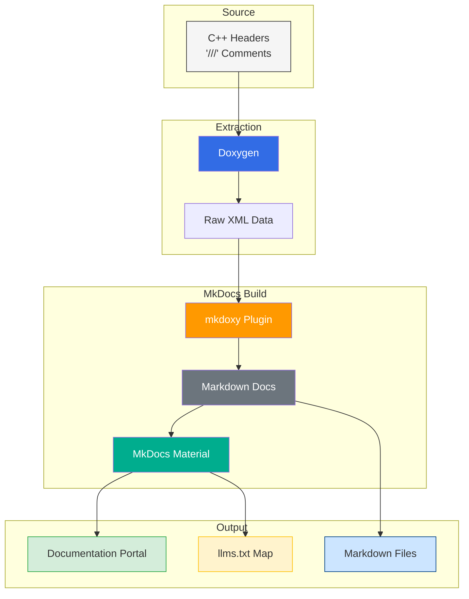

# Documentation Pipeline CI/CD   

## Stack



## Installation

### uv (recommended — all platforms)

The project ships with [`pyproject.toml`](pyproject.toml) and
[`requirements.txt`](requirements.txt) so you can use
[uv](https://docs.astral.sh/uv/) for fast, reproducible installs.

```bash
# Install uv (once)
pip install uv          # or: curl -Ls https://astral.sh/uv/install.sh | sh

# Create a virtual environment and install all dependencies
uv sync                 # reads pyproject.toml, creates .venv/

# Or install from requirements.txt into the active environment
uv pip install -r requirements.txt
```

After `uv sync` all MkDocs commands run inside the managed venv:

```bash
uv run mkdocs build
uv run mkdocs serve
```

---

### Linux (Ubuntu/Debian)
```bash
# 1. Install Doxygen and Python
sudo apt-get update
sudo apt-get install -y doxygen python3 python3-pip unzip wget

# 2. Install MkDocs Material, mkdoxy, and mkdocs-llmstxt
pip install mkdocs-material mkdoxy mkdocs-llmstxt
```

### Windows
```PowerShell
# 1. Install Doxygen and Python via Winget
winget install -e --id DimitriVanHeesch.Doxygen
winget install Python.Python.3

# 2. Install MkDocs Material, mkdoxy, and mkdocs-llmstxt
pip install mkdocs-material mkdoxy mkdocs-llmstxt
```

### macOS
```bash
# 1. Install Doxygen and Python
brew install doxygen python

# 2. Install MkDocs Material, mkdoxy, and mkdocs-llmstxt
pip install mkdocs-material mkdoxy mkdocs-llmstxt
```

### FreeBSD
```sh
# 1. Install Doxygen and Python
sudo pkg install doxygen python3 py311-pip

# 2. Install MkDocs Material, mkdoxy, and mkdocs-llmstxt
pip install mkdocs-material mkdoxy mkdocs-llmstxt
```

## Project Files

### mkdocs.yml with Frontend Material Theme and mkdoxy Plugin: [`mkdocs.yml`](mkdocs.yml) 

The `llmstxt` plugin requires `site_url` to be set — it uses it to build
absolute links inside `llms.txt`. Set it to your deployment URL:

```yaml
site_name: My Project
site_url: https://your-domain.com/   # required by llmstxt
```

The `mkdoxy` plugin is configured under `plugins` in `mkdocs.yml`:

```yaml
plugins:
  - search
  - llmstxt:
      sections:
        Guides:
          - index.md
        API Reference:
          - example/annotated.md
          - example/classes.md
          - example/files.md
          - example/functions.md
          - example/namespaces.md
  - mkdoxy:
      # Set doxygen-bin-path to the Doxygen binary location for your OS.
      # Replace with the correct path:
      #   Windows        : C:\Program Files\doxygen\bin\doxygen.exe
      #   Linux / FreeBSD: /usr/bin/doxygen
      #   macOS (Homebrew): /opt/homebrew/bin/doxygen
      doxygen-bin-path: "C:\\Program Files\\doxygen\\bin\\doxygen.exe"
      # save-api: points to the MkDocs docs_dir so generated .md files are
      # written into docs/<project>/ and committed to the repository.
      # This makes the API reference browsable as plain Markdown on GitHub/GitLab
      # without running a build, and keeps them under version control.
      save-api: "docs/"
      projects:
        myProject:
          src-dirs: include/
          full-doc: true
          doxy-cfg:
            RECURSIVE: YES
            EXTRACT_ALL: YES
            EXTRACT_PRIVATE: NO
            EXTRACT_STATIC: YES
```

## Generation

### Local Execution Workflow

mkdoxy runs Doxygen internally — no separate Doxygen or conversion step needed.

```bash
# Build the static site (generates both HTML under site/ and .md files under docs/<project>/)
mkdocs build

# For live preview during development:
mkdocs serve
```

Setting `save-api: "docs/"` points mkdoxy at the MkDocs source directory.
After `mkdocs build` the layout is:

```
docs/
  index.md         ← hand-authored home page
  example/         ← generated .md files (annotated.md, classes.md, …)
site/
  index.html       ← rendered HTML
  example/         ← rendered API HTML pages
```

`docs/example/` is committed to the repository alongside the hand-authored
pages. This means the API reference is readable as plain Markdown directly on
GitHub or GitLab — no build step required for readers who just browse the repo.

```bash
# After build, stage everything including generated docs
mkdocs build
git add docs/
git commit -m "docs: regenerate API reference"
```

### **Note:** Append the file `.gitignore` to the project .gitignore.

## CI/CD — GitHub Actions

The workflow at [`.github/workflows/docs.yml`](.github/workflows/docs.yml)
automatically builds and deploys the documentation to **GitHub Pages** on
every push to `main` that touches `include/`, `docs/`, or `mkdocs.yml`.

### What the workflow does

1. Checks out the repository.
2. Installs Doxygen (Ubuntu package) and Python.
3. Installs `mkdocs-material`, `mkdoxy`, and `mkdocs-llmstxt`.
4. Patches the `doxygen-bin-path` in `mkdocs.yml` to the Linux binary path
   (the file stores the Windows path for local development).
5. Builds the site with `mkdocs build` and uploads the `site/` directory as a
   Pages artifact.
6. A separate `deploy` job deploys the artifact to GitHub Pages via the
   official `actions/deploy-pages` action.

### One-time setup

1. In your GitHub repository go to **Settings → Pages**.
2. Set **Source** to `GitHub Actions`.
3. Update `site_url` in `mkdocs.yml` to your Pages URL
   (e.g. `https://<user>.github.io/<repo>/`).
4. Commit and push — the workflow handles everything else.

### Trigger

```yaml
on:
  push:
    branches:
      - main
    paths:
      - 'include/**'
      - 'docs/**'
      - 'mkdocs.yml'
```

The build only runs when documentation-related files change, saving CI
minutes on unrelated commits.