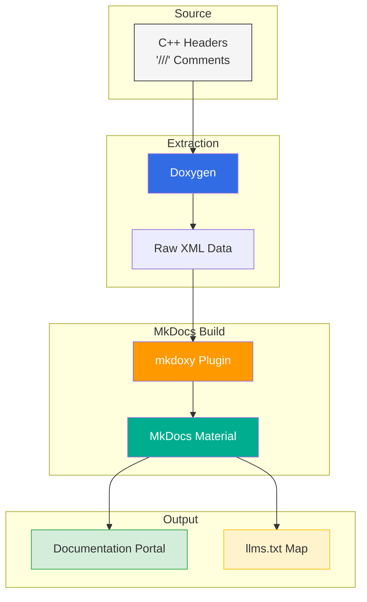

# Documentation Pipeline CI/CD   

## Stack



## Installation

### Linux (Ubuntu/Debian)
```bash
# 1. Install Doxygen and Python
sudo apt-get update
sudo apt-get install -y doxygen python3 python3-pip unzip wget

# 2. Install MkDocs Material and mkdoxy
pip install mkdocs-material mkdoxy
```

### Windows
```PowerShell
# 1. Install Doxygen and Python via Winget
winget install -e --id DimitriVanHeesch.Doxygen
winget install Python.Python.3

# 2. Install MkDocs Material and mkdoxy
pip install mkdocs-material mkdoxy
```

### macOS
```bash
# 1. Install Doxygen and Python
brew install doxygen python

# 2. Install MkDocs Material and mkdoxy
pip install mkdocs-material mkdoxy
```

### FreeBSD
```sh
# 1. Install Doxygen and Python
sudo pkg install doxygen python3 py311-pip

# 2. Install MkDocs Material and mkdoxy
pip install mkdocs-material mkdoxy
```

## Project Files

### mkdocs.yml with Frontend Material Theme and mkdoxy Plugin: [`mkdocs.yml`](mkdocs.yml) 

The `mkdoxy` plugin is configured under `plugins` in `mkdocs.yml`:

```yaml
plugins:
  - mkdoxy:
      # Set doxygen-bin-path to the Doxygen binary location for your OS.
      # Replace with the correct path:
      #   Windows        : C:\Program Files\doxygen\bin\doxygen.exe
      #   Linux / FreeBSD: /usr/bin/doxygen
      #   macOS (Homebrew): /opt/homebrew/bin/doxygen
      doxygen-bin-path: "C:\\Program Files\\doxygen\\bin\\doxygen.exe"
      projects:
        myProject:
          src-dirs: include/
          full-doc: true
          doxy-cfg:
            RECURSIVE: YES
            EXTRACT_ALL: YES
            EXTRACT_PRIVATE: NO
            EXTRACT_STATIC: YES
```

## Generation

### Local Execution Workflow

mkdoxy runs Doxygen internally — no separate Doxygen or conversion step needed.

```bash
# Build the static site
mkdocs build

# For live preview during development:
mkdocs serve
```