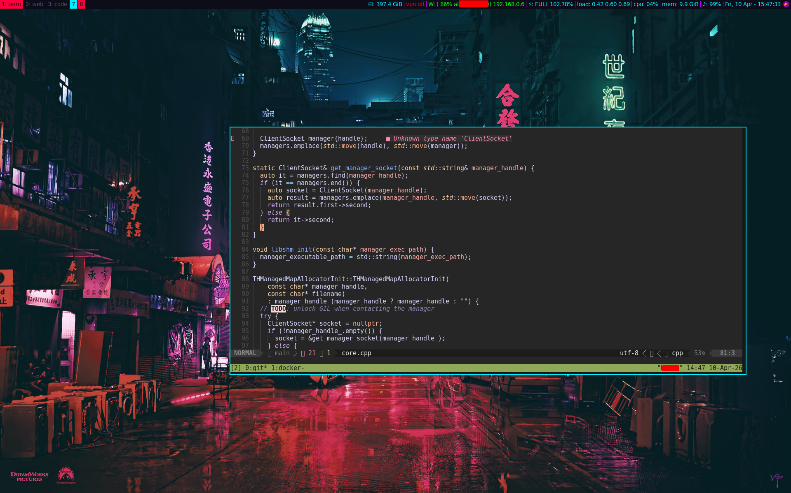

# i3 Configuration

Configuration files for [i3](https://i3wm.org/) and [i3status](https://i3wm.org/i3status/).

## Screenshot  

  
> Wallpaper by [azzaziel1991](https://wallhaven.cc/w/6omxxl) 

## Files

| File | Description |
|---|---|
| `config` | Main i3 window manager configuration |
| `i3status.conf` | Status bar configuration for i3bar via i3status |

### `config` highlights

| Section | Details |
|---|---|
| Mod key | `Super` (Win key) |
| Terminal | `alacritty` |
| Launcher | `rofi` (drun / window / clipboard) |
| Colors | Cyberpunk palette |
| Workspaces | 7 named workspaces (`term`, `web`, `code`, `code2`, `vm`, `files`, `stack`) with app assignments |
| Keybindings | vim-style focus/move, audio, brightness, screenshots, display, keyboard layout |
| Modes | `resize`, `gaps`, `system` (lock/suspend/reboot/shutdown) |
| Autostart | picom, dunst, feh, nm-applet, blueman-applet, polkit, xrandr (HDMI-1 left of eDP-1) |

#### Display & Keyboard shortcuts

| Keybinding | Action |
|---|---|
| `Super+Shift+P`       | Dual-screen setup (HDMI-1 left of eDP-1) |
| `Super+Ctrl+P`        | Dual-screen setup (HDMI-1 above eDP-1) |
| `Super+Ctrl+Shift+P`  | Dual-screen setup (HDMI-1 right of eDP-1) |
| `Super+Shift+B` | Keyboard layout: Brazilian (`br`) |
| `Super+Shift+U` | Keyboard layout: US International (`us intl`) |

## Dependencies

```
i3 i3status rofi alacritty picom dunst feh
playerctl brightnessctl scrot numlockx
pulseaudio-utils (pactl)  OR  pipewire-pulse
pavucontrol
blueman
network-manager-gnome (nm-applet)
```

Install on Debian/Ubuntu:

```sh
sudo apt install i3 i3status rofi alacritty picom dunst feh \
    playerctl brightnessctl scrot numlockx pulseaudio-utils pavucontrol \
    blueman network-manager-gnome
```

Install on Arch Linux:

```sh
sudo pacman -S i3-wm i3status rofi alacritty picom dunst feh \
    playerctl brightnessctl scrot numlockx pavucontrol \
    blueman network-manager-applet
```

Install on Fedora:

```sh
sudo dnf install i3 i3status rofi alacritty picom dunst feh \
    playerctl brightnessctl scrot numlockx pavucontrol \
    blueman network-manager-applet
```

Install on FreeBSD:

```sh
sudo pkg install i3 i3status rofi alacritty picom dunst feh \
    playerctl brightnessctl scrot numlockx pavucontrol \
    blueman network-manager-applet
```

## Install

Copy `config` to the i3 config directory:

```sh
mkdir -p ~/.config/i3
cp config ~/.config/i3/config
```

Or symlink:

```sh
mkdir -p ~/.config/i3
ln -sf "$(pwd)/config" ~/.config/i3/config
```

Copy `i3status.conf` to the i3status config directory:

```sh
mkdir -p ~/.config/i3status
cp i3status.conf ~/.config/i3status/config
```

Or symlink to keep it in sync with this repo:

```sh
mkdir -p ~/.config/i3status
ln -sf "$(pwd)/i3status.conf" ~/.config/i3status/config
```

Reload i3bar to apply:

```sh
killall -SIGUSR1 i3status
```

Or reload i3 entirely:

```sh
i3-msg restart
```

## Update

If using a symlink, changes to `i3status.conf` take effect after reloading i3status:

```sh
killall -SIGUSR1 i3status
```

If using a copy, re-run the copy command after pulling changes:

```sh
cp i3status.conf ~/.config/i3status/config
killall -SIGUSR1 i3status
```

## Status Bar Modules

The following i3status modules are configured:

| Module | Description |
|---|---|
| `disk /` | Available disk space on root |
| `ethernet enp1s0` | Physical ethernet status and IP |
| `ethernet tun0` | VPN connection status |
| `wireless wlp0s20f3` | Wi-Fi quality, SSID, and IP |
| `battery 0` | Battery status and percentage |
| `load` | System load averages (1, 5, 15 min) |
| `cpu_usage` | CPU usage percentage |
| `memory` | Available memory with degraded/critical thresholds |
| `volume master` | ALSA master volume |
| `tztime local` | Local date and time |
| `run_watch sshd` | SSH daemon status |
| `run_watch docker` | Docker daemon status |

## Adjustments

- **Wi-Fi interface**: Update `wlp0s20f3` to match your interface (`ip link` to list interfaces).
- **Ethernet interface**: Update `enp1s0` to match your interface.
- **PID file paths**: Some distros use `/run/` instead of `/var/run/` — adjust `run_watch` pidfile paths if needed.
